# VulneraX: Project Documentation

## 1. Problem Statement
Modern web applications rely heavily on Single Page Application (SPA) frameworks and complex client-side rendering, making it difficult for traditional, static vulnerability scanners to discover all endpoints and attack surfaces. Furthermore, when vulnerabilities are found, the output is often dense and lacks actionable, contextual remediation advice for developers. 

**VulneraX** solves this by providing a Next-Generation AI-Powered Vulnerability Scanner. It features a headless browser crawler (Playwright) capable of navigating complex SPAs and injecting authenticated session states. It integrates real-time telemetry via WebSockets to keep users informed without page reloads, and leverages Large Language Models (Google Gemini) to provide structured, developer-friendly threat intelligence and patch code snippets.

---

## 2. Team Roles (4 Members)

The project is logically divided to accommodate four developers, ensuring clear separation of concerns across the stack:

1. **Frontend Architect & UI/UX Designer**
   - **Focus:** User Interface, animations, and real-time data consumption.
   - **Responsibilities:** Designed and implemented the 3D Glassmorphic dashboard using React, TailwindCSS, and GSAP. Integrated the WebSocket client to dynamically reflect scan progress and crafted the AI Remediation Panel UI.
   
2. **Backend & Infrastructure Architect**
   - **Focus:** API design, concurrency, and database management.
   - **Responsibilities:** Developed the FastAPI backend and SQLAlchemy database layer. Engineered the `asyncio` task orchestrator to manage concurrent scans without blocking, and built the WebSocket Connection Manager for real-time telemetry broadcasts.

3. **Application Security Engineer**
   - **Focus:** Reconnaissance, crawling, and vulnerability detection logic.
   - **Responsibilities:** Built the headless Playwright SPA crawler to dynamically discover endpoints. Developed the security modules including Port Scanning, Header/Cookie analysis, and active exploit checks for XSS, SQLi, and Path Traversal.

4. **AI Integration & Reporting Engineer**
   - **Focus:** Threat intelligence mapping and report generation.
   - **Responsibilities:** Integrated the `google.genai` SDK using Pydantic JSON schemas to guarantee structured AI remediation outputs. Developed the risk-scoring algorithm and built the export system for JSON, PDF, CSV, and HTML reports.

---

## 3. Modules

1. **Authentication & Identity Module**
   - Handles user registration, JWT-based login, and secures API routes.
2. **Scanner Orchestration Module**
   - The central nervous system. Manages asynchronous scan tasks, rate-limiting, and state tracking.
3. **Reconnaissance & Web Analysis Module**
   - Performs DNS lookups, banner grabbing, port scanning, and evaluates SSL, Cookies, and HTTP Headers.
4. **Headless Crawling Module**
   - Uses Playwright to simulate a real browser, capturing XHR/Fetch requests to build a map of the target SPA.
5. **Vulnerability Engine Module**
   - Executes targeted payloads against discovered endpoints to confirm vulnerabilities (XSS, SQLi, etc.).
6. **AI Threat Intelligence Module**
   - Sends vulnerability data to Gemini 1.5 to generate structured Root Cause Analysis and Patch code.
7. **Telemetry & Dashboard Module**
   - The WebSocket router and frontend UI working in tandem to display live progress bars, risk charts, and attack graphs.

---

## 4. System Architecture and Tech Stack

### Tech Stack
- **Frontend**: React, Vite, TailwindCSS, GSAP (Animations), Lucide (Icons)
- **Backend**: FastAPI (Python), Uvicorn, asyncio, SQLAlchemy, SQLite
- **Security & Crawling**: Playwright (Headless Chromium), custom Python async scanning scripts
- **AI Integration**: Google Gemini 1.5 Pro via `google.genai` SDK
- **Communication**: REST API, WebSockets (Real-time telemetry)

### Architecture Diagram

---

## 5. Data Flow Diagram (Level 1 DFD)

The following Data Flow Diagram (DFD) illustrates how data moves through the major processes of the VulneraX system.

